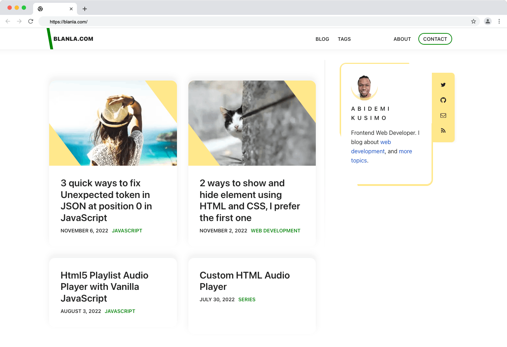
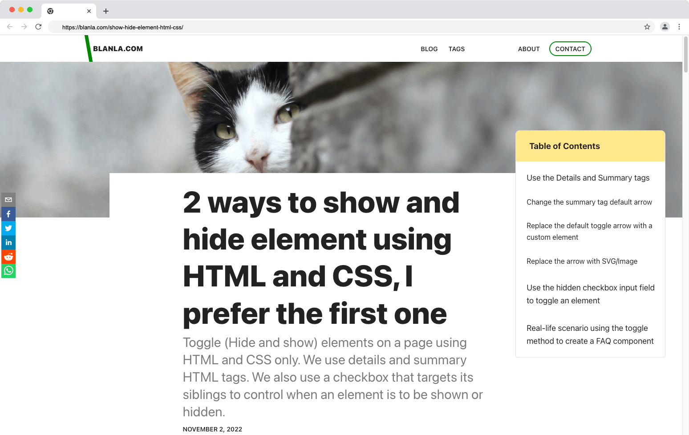
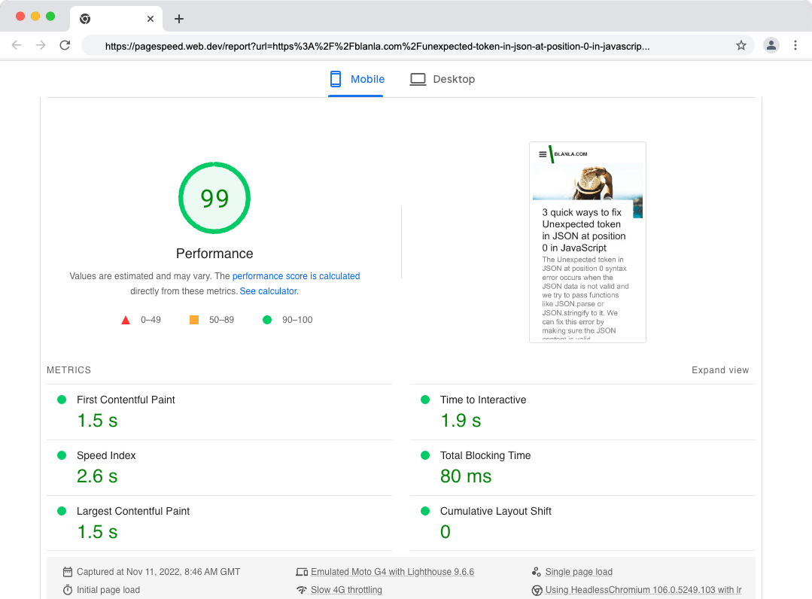

# Blanla.com

## Features
- Featured image
- Post thumbnail
- Table of contents
- Prismjs - to display code in frontend
- Related post / Suggested
- Social share
- Dark / Light mode toggle
- Tags
- Optimised for core web vital




### Demo 
[blanla.com](https://blanla.com/)


This is a site built with [Gatsby.js](https://www.gatsbyjs.org/) using [gatsby-starter-lumen](https://github.com/alxshelepenok/gatsby-starter-lumen). Hosted on shared hosting package. To get started:

>I'm using node version 14, if you have NVM (Node Version Manager) installed, use it to switch to node version 14 as this will not work well with the latest version of node.

- Open package.json and replace every instance of 'blanla.com' with your domain name.
- In package.json, replace the 'repository' value with your git repo
- In config.js, replace every instance of 'blanla.com' with your domain name
- In config.js, replace the googleAnayticsId value with your own Google Analytics ID

## Pages & components you might want to look into
- About page - Change the content of the about page
- Contact page - Change the content to suit your need
- Author.js - Replace Twitter handle and URL
- CarbonAd.js - This contains Google Adsense, change the ID. You can also change this to carbon AD.
- indexTemplate - Change the person schema.
- Sitemap - Change the URL in robots.txt, this can be found inside the static folder.

### Run the development server

```bash
npm install
npm run develop
```



## Shared hosting
I am using shared hosting. To use shared hosting, you need to upload content through SFTP. You also need to create a .env file inside your root directory. This file (.env) is not included as it contains sensitive data.

The content in the file is as follows:
```code
SFTP_HOST = yoursite.com
SFTP_USERNAME = your_sftp_name
SFTP_PASSWORD = your_sftp_password
SFTP_PUBLIC = /your_home_dir/your_dir/folder_that_host_your_file/
LIVE_DEPLOY = true

ADWORD_CLIENT =  your_google_client_id // This is not part of the above SFTP settings
```

Once you have added your SFTP details in the .env file, run this command to upload the content to the live server.

```bash
npm run deploy-live
```



## Features available but disabled
There are other features I am not using on my site, this project was forked from [victorzhou.com](https://github.com/vzhou842/victorzhou.com). I have disabled the following features.

- Comment
- Subscribe

### Todo

- [ ] Add search 
- [ ] Add Gatsby dracula theme for Prism
- [ ] Add image credit link
- [ ] Remove live posts and create sample posts
