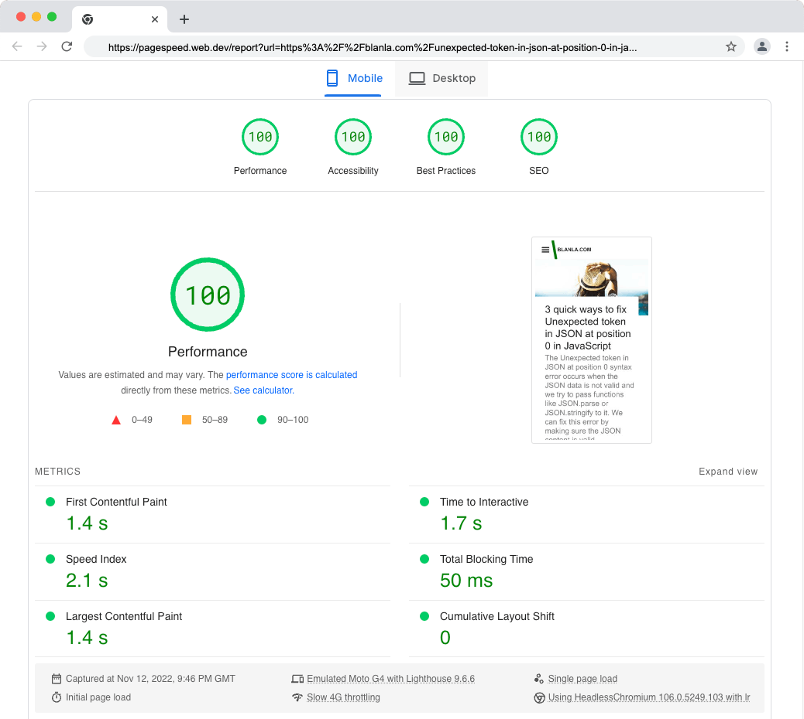

# Blanla.com

This is a Gatsby JS site hosted on shared hosting. This can be hosted anywhere, for example, in the cloud. The site is easy to deploy and host with any hosting provider.


## Features
- Featured image
- Post thumbnail
- Table of contents
- Prismjs - to display code in frontend
- Related post / Suggested
- Social share
- Dark / Light mode toggle
- Tags
- Post navigation
- Optimised for core web vital


### Demo 
[blanla.com](https://blanla.com/)


This is a site built with [Gatsby.js](https://www.gatsbyjs.org/) using [gatsby-starter-lumen](https://github.com/alxshelepenok/gatsby-starter-lumen). Hosted on shared hosting package. To get started:

>I'm using node version 14, if you have NVM (Node Version Manager) installed, use it to switch to node version 14 as this will not work well with the latest version of node.

- Open package.json and replace every instance of 'blanla.com' with your domain name.
- In package.json, replace the 'repository' value with your git repo
- In config.js, replace every instance of 'blanla.com' with your domain name
- In config.js, replace the googleAnayticsId value with your own Google Analytics ID

## Pages & components you might want to look into
- About page - Change the content of the about page
- Contact page - Change the content to suit your need
- Author.js - Replace Twitter handle and URL
- CarbonAd.js - This contains Google Adsense, change the ID. You can also change this to carbon AD.
- indexTemplate - Change the person schema.
- Sitemap - Change the URL in robots.txt, this can be found inside the static folder.

### Run the development server

```bash
npm install
npm run develop
```


## Shared hosting
I am using shared hosting. To use shared hosting, you need to upload content through SFTP. You also need to create a .env file inside your root directory. This file (.env) is not included as it contains sensitive data.

The content in the file is as follows:
```code
SFTP_HOST = yoursite.com
SFTP_USERNAME = your_sftp_name
SFTP_PASSWORD = your_sftp_password
SFTP_PUBLIC = /your_home_dir/your_dir/folder_that_host_your_file/
LIVE_DEPLOY = true

ADWORD_CLIENT =  your_google_client_id // This is not part of the above SFTP settings
```

Once you have added your SFTP details in the .env file, run this command to upload the content to the live server.

```bash
npm run deploy-live
```

### .htaccess 
Don't forget to update the .htaccess file on the server in the document root. Your .htacess file should look something as follow:

```code
<IfModule mod_rewrite.c>
RewriteEngine On
RewriteRule .* - [E=HTTP_AUTHORIZATION:%{HTTP:Authorization}]
RewriteBase /
RewriteRule ^index\.html$ - [L]
RewriteCond %{REQUEST_FILENAME} !-f
RewriteCond %{REQUEST_FILENAME} !-d
RewriteRule . /index.html [L]
</IfModule>
```



### Page speed
The page speed of the site is good, but adding little optimisation like expanding the static assets cache lifetime will result in even better performance.

**Optional** - If you have not already added this to your .htaccess. This is the snippet I'm using for efficient cache policy. Add this in the .htaccess file.

> Take extra caution when editing .htaccess file, backup up the file before you commit any change.

```code
<FilesMatch "index\.(html|htm)$">
AddDefaultCharset UTF-8
<ifModule mod_headers.c>
FileETag None
Header unset ETag
Header set Cache-Control "max-age=0, no-cache, no-store, must-revalidate"
Header set Pragma "no-cache"
Header set Expires "Mon, 29 Oct 1923 20:30:00 GMT"
</ifModule>
</FilesMatch>
# END CachePolicy
# BEGIN GzipCache
<IfModule mod_deflate.c>
AddType x-font/woff .woff
AddType x-font/ttf .ttf
AddOutputFilterByType DEFLATE image/svg+xml
AddOutputFilterByType DEFLATE text/plain
AddOutputFilterByType DEFLATE text/html
AddOutputFilterByType DEFLATE text/xml
AddOutputFilterByType DEFLATE text/css
AddOutputFilterByType DEFLATE text/javascript
AddOutputFilterByType DEFLATE text/json
AddOutputFilterByType DEFLATE application/json
AddOutputFilterByType DEFLATE application/xml
AddOutputFilterByType DEFLATE application/xhtml+xml
AddOutputFilterByType DEFLATE application/rss+xml
AddOutputFilterByType DEFLATE application/javascript
AddOutputFilterByType DEFLATE application/x-javascript
AddOutputFilterByType DEFLATE application/x-font-ttf
AddOutputFilterByType DEFLATE x-font/ttf
AddOutputFilterByType DEFLATE application/vnd.ms-fontobject
AddOutputFilterByType DEFLATE font/opentype font/ttf font/eot font/otf
</IfModule>
# END GzipCache
# BEGIN FastestCache
<FilesMatch "\.(webm|ogg|mp4|json|ico|pdf|flv|avif|jpg|jpeg|png|gif|webp|js|css|swf|x-html|css|xml|js|woff|woff2|otf|ttf|svg|eot)(\.gz)?$">
<IfModule mod_expires.c>
AddType application/font-woff2 .woff2
AddType application/x-font-opentype .otf
ExpiresActive On
ExpiresDefault A0
ExpiresByType video/webm A10368000
ExpiresByType video/ogg A10368000
ExpiresByType video/mp4 A10368000
ExpiresByType image/avif A10368000
ExpiresByType image/webp A10368000
ExpiresByType image/gif A10368000
ExpiresByType image/png A10368000
ExpiresByType image/jpg A10368000
ExpiresByType image/jpeg A10368000
ExpiresByType image/ico A10368000
ExpiresByType image/svg+xml A10368000
ExpiresByType text/css A10368000
ExpiresByType text/javascript A10368000
ExpiresByType application/javascript A10368000
ExpiresByType application/x-javascript A10368000
ExpiresByType application/font-woff2 A10368000
ExpiresByType application/x-font-opentype A10368000
ExpiresByType application/x-font-truetype A10368000
</IfModule>
<IfModule mod_headers.c>
Header set Expires "max-age=A10368000, public"
Header unset ETag
Header set Connection keep-alive
FileETag None
</IfModule>
</FilesMatch>

```

## Features available but disabled
There are other features I am not using on my site, this project was forked from [victorzhou.com](https://github.com/vzhou842/victorzhou.com). I have disabled the following features.

- Comment
- Subscribe

### Todo

- [ ] Add search 
- [ ] Add image credit link